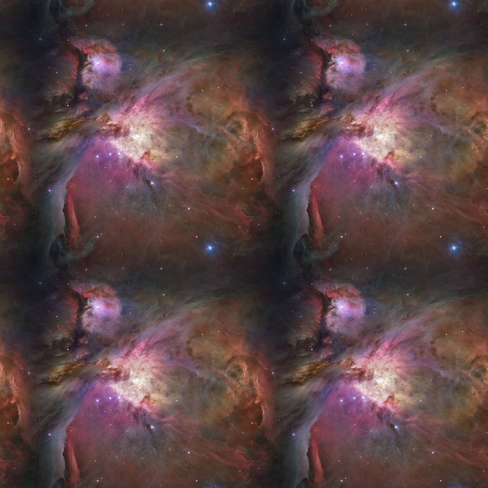

# [img2texture](https://github.com/rtmigo/img2texture_py#readme) (DRAFT)

Command line utility for converting images to seamless tiles.

The resulting tiles can be used as textures in games, compositing and 3D modeling applications, etc.

<details>
  <summary>Sample images</summary>


### Original image x4


Orion galaxy by NASA/ESA.

We cannot use the original image as an endless space background: the seams are visible.

### Converted image x4



This shows the result of `img2texture`, for clarity in four copies side by side. 

The image is slightly reduced in size and the edges are modified with 
alpha-blending.

Seams no longer appear when merging. The converted image can be tiled and panned in any 
direction. It will feel endless and seamless.


</details>

# Install

```
$ pip3 install https://github.com/rtmigo/img2texture_py
```

# Run

```
$ img2texture /path/to/source.jpg /path/to/seamless_result.jpg 
```

