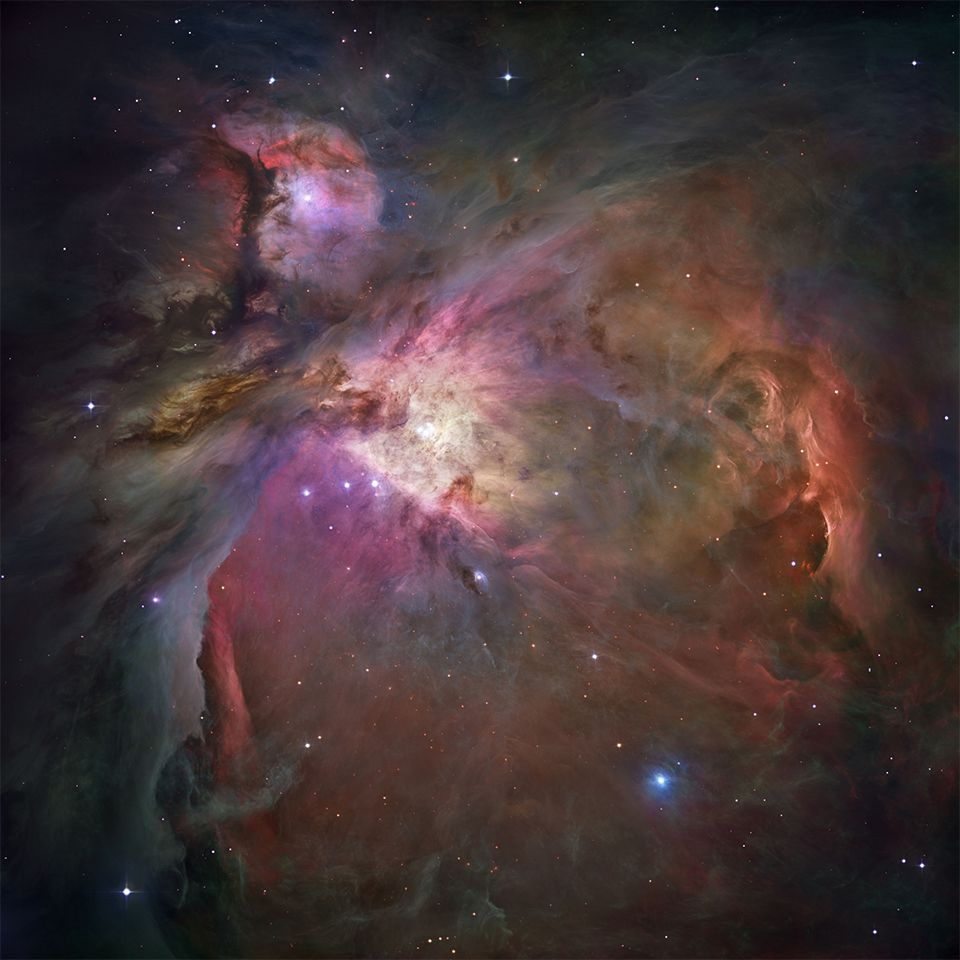
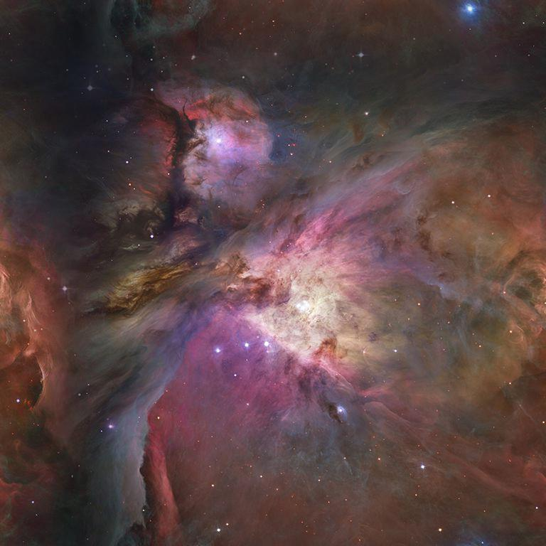

# [img2texture](https://github.com/rtmigo/img2texture_py#readme) (DRAFT)

Command line utility for converting images to seamless tiles.

The resulting tiles can be used as textures in games, compositing and 3D modeling applications, etc.

<details>
  <summary>Sample images</summary>

### Source image

This is an image of the Orion galaxy from NASA / ESA.

 

### Four copies of source image side by side  


It cannot be used as an endless background: the seams are visible.

### Converted image

This is the result of `img2texture`. The image is slightly reduced in size and 
the edges are modified with simple alpha-blending.



### Four copies of converted image side by side

The seams between the tiles are disappeared.


With the proper magnification, this texture can be panned in any direction. It will feel endless and seamless.


</details>

# Install

```
$ pip3 install https://github.com/rtmigo/img2texture_py
```

# Run

```
$ img2texture /path/to/source.jpg /path/to/seamless_result.jpg 
```

