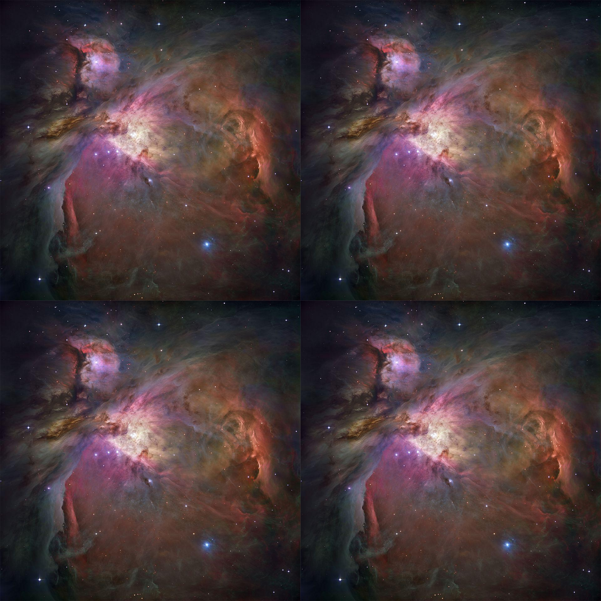
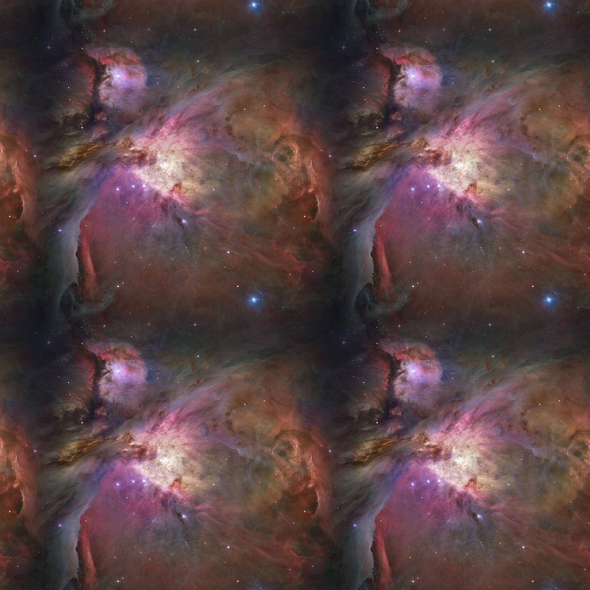
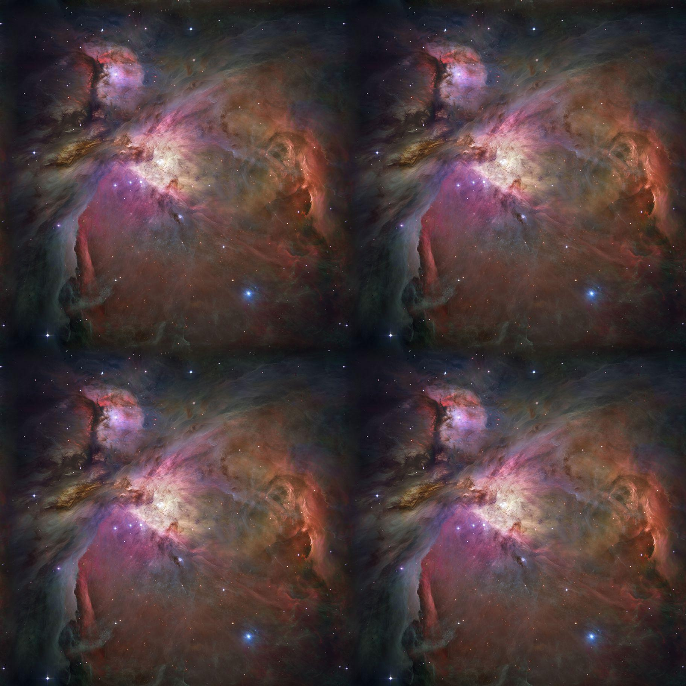
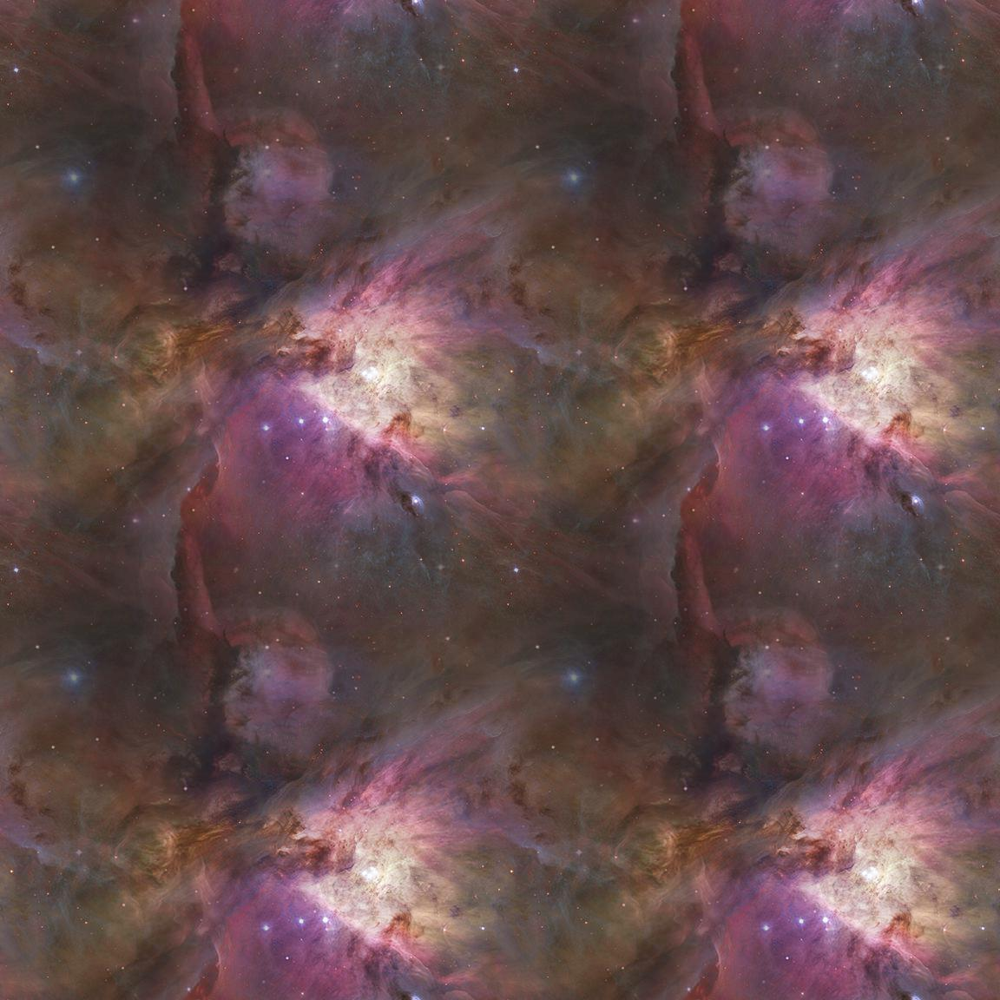

[](https://pypi.python.org/pypi/img2texture/)
[](#)
[](#)

# [img2texture](https://github.com/rtmigo/img2texture_py#readme)

Command line utility for converting images to seamless tiles.

The resulting tiles can be used as textures in games, compositing and 3D modeling applications, etc.

<details>
  <summary>Sample images</summary>


*⚠️ If the images below are not displayed, check out the 
[original of this document on GitHub](https://github.com/rtmigo/img2texture_py#readme).*

### Original image x4



Orion galaxy by NASA/ESA, in four copies side by side. 

We cannot use the original image as an endless space background: the seams are visible.

### Converted image x4



The result of `img2texture`, in four copies side by side. 

The image is slightly reduced in size and the edges are modified with 
alpha-blending.

The converted image can be tiled and panned in any 
direction. It will feel endless and seamless.


</details>

# Install

```
$ pip3 install img2texture
```

# Run

Create new `seamless.jpg` from `source.jpg`.
```
$ img2texture /path/to/source.jpg /path/to/seamless.jpg 
```

## --overlap

The `--overlap` option determines how much of the image will be used to hide the seams.

For example, the following command uses 25% of the width and 25% of the height 
of the original image:

```
$ img2texture source.jpg seamless.jpg --overlap 0.25 
```

Increasing the value makes the seam less visible. However, the image becomes smaller.

<details>
  <summary>Sample images</summary>

*⚠️ If the images below are not displayed, check out the 
[original of this document on GitHub](https://github.com/rtmigo/img2texture_py#readme).*


### --overlap 0.05

5% of the width and 5% of the height are used to mask the seam.




### --overlap 0.4

40% of the width and 40% of the height are used to mask the seam.



</details>

## --tile

The `--tile` option will create a 2x2 tiled version in addition to the converted image.

The following command will create `seamless.jpg` and `seamless_2x2.jpg`. 

```
$ img2texture source.jpg seamless.jpg --tile 
```

All the samples on this page were created with `--tile`.
